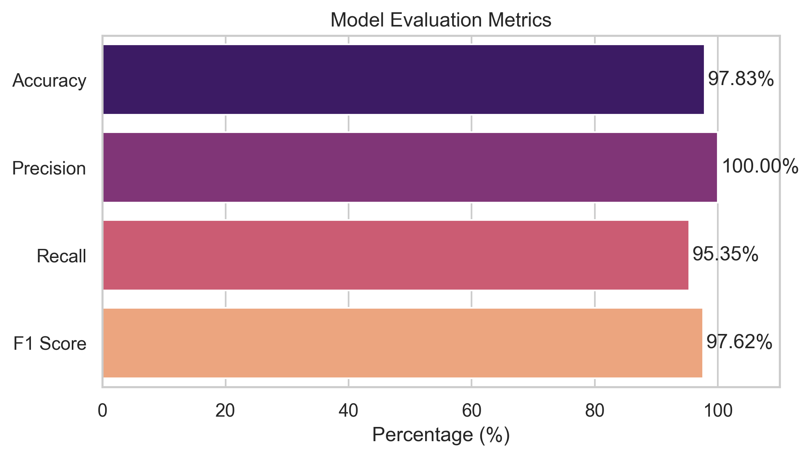
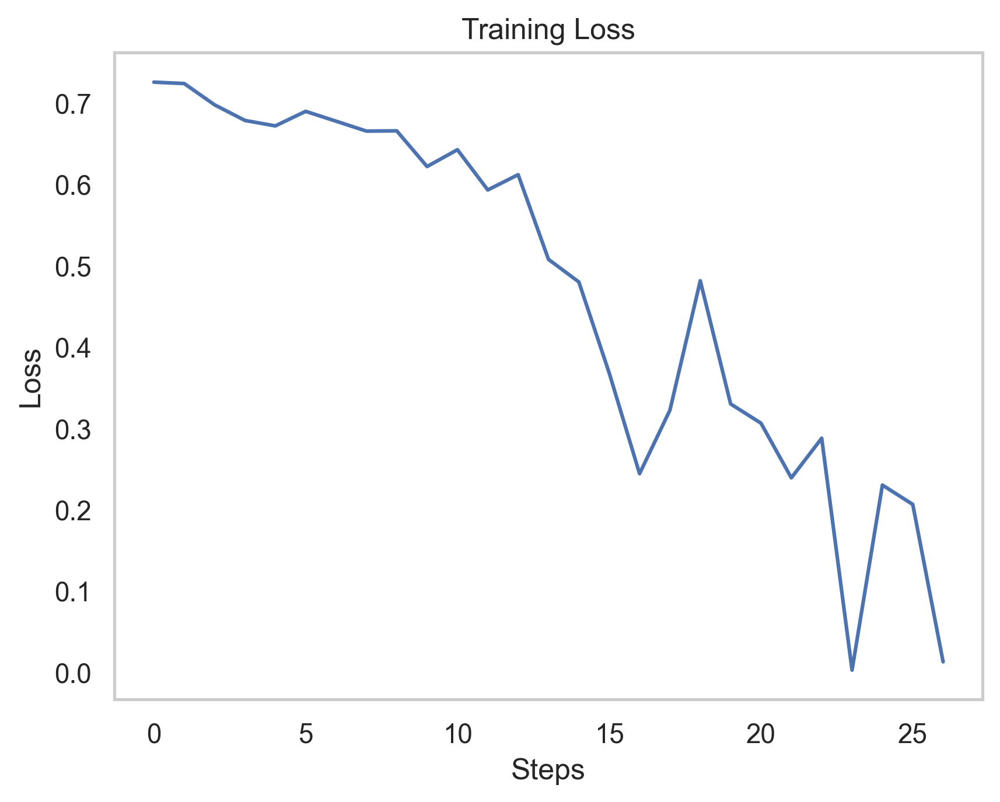
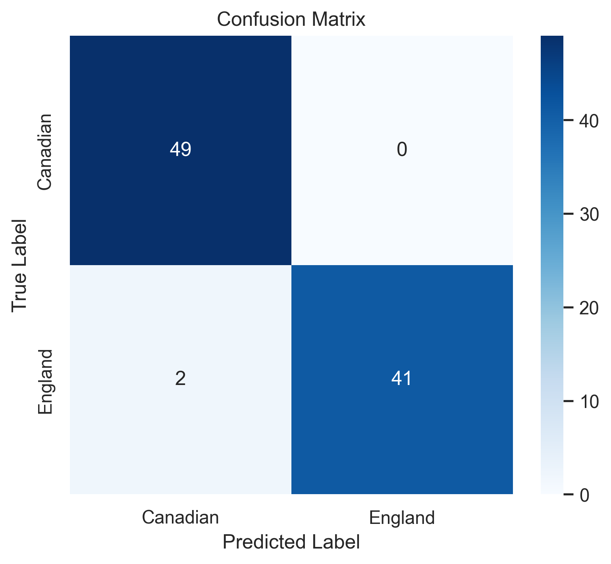
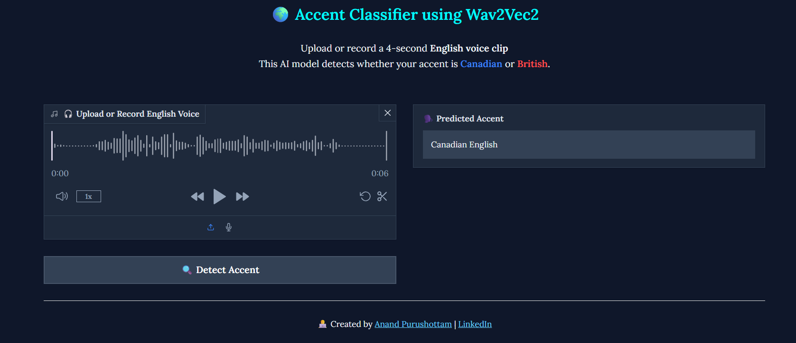

# 🎙️ Accent Classification using Wav2Vec2

### A Deep Learning project that uses `HuggingFace's Wav2Vec2` model to classify English audio accents as **`Canadian`** 🇨🇦 or **`British (England)`** 🏴. 

### Built with `PyTorch`, `Transformers`, and `Librosa`, this project achieves high accuracy on voice-based accent prediction.

---


[](https://www.linkedin.com/in/creativepurus/)

---

## ✅ Results


---

## 📊 Model Performance Visualizations

Below are various graphs and charts generated to evaluate and visualize the performance of the Wav2Vec2-based Accent Classifier:

---

### 🔹 Horizontal Bar Chart

*Class-wise prediction confidence of the model.*

---

### 🔹 Training Loss Curve

*Loss reduction over training epochs showing model learning progress.*

---

### 🔹 Confusion Matrix

*Matrix showing the number of correct and incorrect predictions per class.*

---

### 🖥️ Gradio Web App

A sleek, dark-themed **Gradio interface** has been added to make accent classification interactive and user-friendly!

* 🎤 Supports both **microphone recording** and **file upload**.
* 🧠 Uses the fine-tuned `Wav2Vec2` model for detecting **Canadian** or **British** English accents.
* 🌌 Clean dark mode layout with **colorful buttons** for a smooth user experience.
* ✅ Built with `gradio==5.38.2`.

> 🚀 Simply run `app.py` to launch the app locally:
>
> ```bash
> python app.py
> ```

### 🔹 Gradio interface Before Prediction


### 🔹 Gradio interface After Prediction

---

## 🚀 Features

- Fine-tuned Wav2Vec2-Large-960h model
- Custom classification head for binary accent classification
- Achieved **97.83% Accuracy**, **100% Precision**, **97.62% F1 Score**
- Audio pre-processing with Librosa & Torchaudio
- Exportable results in CSV + visualizations
- Easy-to-use Jupyter Notebook interface

---

## 🛠️ Tech Stack

- Python
- PyTorch
- HuggingFace Transformers
- Librosa
- Scikit-learn
- Matplotlib / Seaborn
- Git / GitHub

---

## 🧰 Setup Instructions

> Follow these steps to set up the project on your local machine.

### 1️⃣ Prerequisites

- Python 3.9 or higher
- Git installed ([Download Git](https://git-scm.com/downloads))

### 2️⃣ Clone the Repository

```bash
git clone https://github.com/creativepurus/Accent_Classification.git
cd Accent_Classification
```

### 3️⃣ Create & Activate a Virtual Environment

```bash
# Create venv (do this only once)
python -m venv venv

# Activate venv
# On Windows:
venv\Scripts\activate
# On macOS/Linux:
source venv/bin/activate
```

### 4️⃣ Install Dependencies

```bash
pip install -r requirements.txt
```

### 5️⃣ Run the Jupyter Notebook

```bash
jupyter notebook
```

Open `en_model.ipynb` and run the cells step-by-step.

---

## 📊 Outputs

- `model_predictions.csv` → Stores predictions with confidence
- Graphs folder → Contains plots like confusion matrix, class-wise distribution
- Trained model saved to `wav2vec2-accent-classifier/`

---

## 🗂️ Project Structure

```
Accent_Classification/
├── .github/                      # GitHub workflows, actions, or templates
├── assets/                      # Images or media assets for README or UI
├── Data/                        # Audio + tsv files
├── Graphs/                      # Evaluation plots
├── Model/                       # Saved Model and processor files (auto-created after training)
├── Accent_Detection_Model.ipynb # Main notebook
├── app.py                       # Gradio-based UI Application
├── Code_Explanation.md          # Detailed explanation of model and code
├── LICENSE                      # Project license file
├── README.md                    # Project overview and instructions
├── requirements.txt             # Python dependencies
└── .gitignore                   # Git ignore rules for GitHub
```

---

## ⚠️ Notes

- Don’t forget to activate your virtual environment before installing packages or running the notebook.
- Make sure audio files and `validated.tsv` are placed correctly in the `en/` folder.

---

## 🧪 Future Improvements

- Add support for more accents (e.g., Australian, Indian, American)
- Deploy as a full-fledged web app
- Integrate with Flask/FastAPI for production API

---

## 👨‍💻 Author

Made with ❤️ by [Anand Purushottam](https://github.com/creativepurus)

[LinkedIn](https://www.linkedin.com/in/creativepurus/) | [GitHub](https://github.com/creativepurus)

### Love My Work ? You can 👉🏻 [](https://www.buymeacoffee.com/creativepurus)

---

## 📄 License

This project is licensed under the `GNU GENERAL PUBLIC LICENSE.`